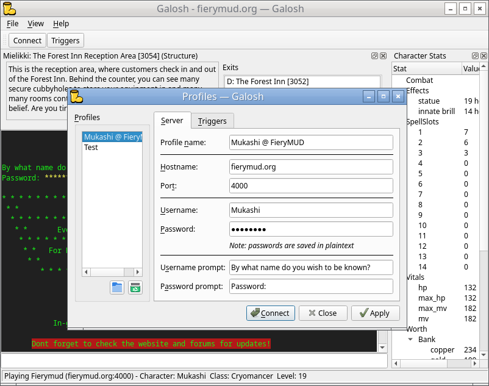

# Galosh 

A cross-platform MUD client.

## Why Galosh?

[Galoshes](https://en.wikipedia.org/wiki/Galoshes) are what you wear when you're going to go out in the mud.

Galosh is inspired by the simplicity of older MUD clients. [Mudlet](https://www.mudlet.org/) is nice &mdash; it's full-featured and well-supported.
And Galosh agrees with Mudlet's vision that the more projects are involved in the MUD ecosystem, the better. So if you find 3D map displays, fancy
scripts, and the like to be a little too much, Galosh may be right for you.

And maybe you'll find something in Galosh that you like. Galosh's tab completion works a little differently, its automapper keeps track of room
descriptions, and it can keep more information about the current room visible at a glance.

## Features

* Cross-platform (Windows, macOS, X11, Wayland)
* ANSI/VT100/VT102 formatting support
* [MSSP](https://mudstandards.org/mud/mssp) protocol support
* [GMCP](https://mudstandards.org/mud/gmcp) protocol support
* Multiple saved profiles
* Triggers
* Automapping _(partial)_
* Environment and status displays
* Command history
* Tab completion
* Mudlet map importing

## Roadmap

* Context-aware tab completion (spellcasting, etc.)
* Map visualization and offline exploration
* Item database
* Smart aliases / custom commands
* Speedwalking / autowalking
* Scripting
* Split-screen
* Prebuilt releases for Windows and macOS

## License

Copyright &copy; 2025 Adam Higerd

Galosh is free software; you can redistribute it and/or modify it under the terms of version 3 of the GNU General Public License as published by
the Free Software Foundation. This program is distributed in the hope that it will be useful, but without any warranty, even the implied warranty
of merchantability or fitness for a particular purpose. See [the full text of the GPLv3](LICENSE.md) for more information.

Galosh makes use of portions of [QTermWidget](https://github.com/lxqt/qtermwidget). QTermWidget is available under the GPLv2 or any later version.
Some source files may be available under a different license. See each file in [src/qtermwidget](src/qtermwidget) for more information.

On Windows, Galosh uses [mman-win32](https://github.com/alitrack/mman-win32), available under the [MIT license](src/mman-win32/LICENSE.MIT).

Galosh is built upon Qt. Qt is copyright &copy; The Qt Company Ltd and other contributors and used under the terms of the GNU Lesser General Public
License version 3. See [Qt's licensing page](https://www.qt.io/licensing/open-source-lgpl-obligations) for more information.
