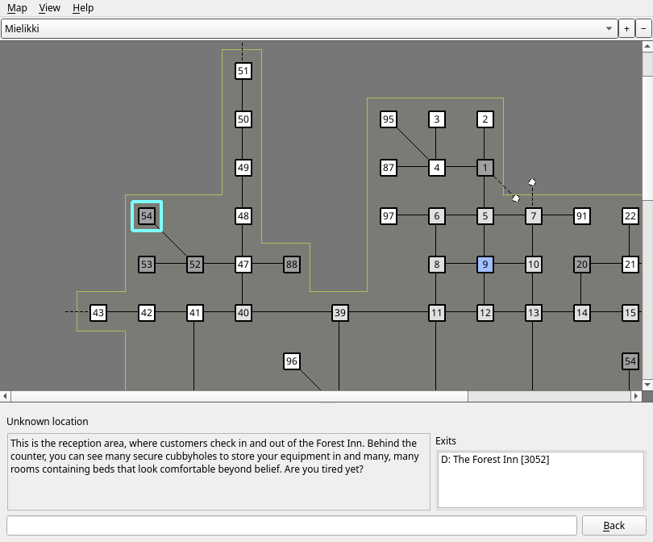

# Map Explorer

Galosh's Map Explorer allows you to examine the map and explore parts of the MUD world that you have already visited, even offline.

The Map Explorer window provides a [menu bar](map-menus.md), a view of the map of a zone, a room description panel, and a command line.

For information about how Galosh collects map information, see the [Mapping page](map.md).

## Map

The dropdown at the top of the map view allows you to select a zone to explore. Click the `+` and `-` buttons to zoom in and out.

Each mapped room in the selected zone is represented as a square:

* The number inside shows the last two digits of the room's numeric ID.
* A light blue outline highlights the current room.
* The color of the square indicates the room's terrain type. Colors and available terrain types can be managed in the
    [Map Settings dialog](map-settings.md).
* Lines connecting squares represent exits between rooms.
    * One-way connections are drawn with an arrowhead.
    * A dotted line represents a connection to an unmapped room.
    * A dotted line to a dotted circle represents a connection to another zone.
    * Exits from a room leading to itself are not shown.
* Colored outlines mark layers, which are rooms that are connected together on the same vertical (up/down) level.
    * The color has no meaning except to make layers visually distinct from each other.
    * If an exit up or down leads to a single room with no additional exits, that room may be included in the same layer.

Galosh tries to arrange rooms in a grid layout. However, complicated maps may not neatly fit into a simple grid without overlapping, or they may
connect in ways that would not be physically possible. When Galosh has to represent an exit that doesn't fit in the grid, it will draw the
connecting line as a colored curve. The color of the curve has no meaning except to make it easier to distinguish it from other lines.

Hover the mouse cursor over a room to show its name and complete numeric ID. Double-click a room to move to it.

Double-click a zone connection to open that zone's map in the map explorer.

## Room Description

The Room Description panel displays information about the current room. It can be resized by dragging the line dividing the map and the room name.

The top of the panel displays the current zone, the name of the current room, the numeric room ID, and the terrain type. Not all MUDs provide this
data, so any missing information will be omitted.

The room description is displayed with minimal formatting to make as much text visible as possible.

The Exits box shows which rooms are known to be accessible from the current room. If an exit has a known door, it will be labeled as closed or
locked, and the name of the door will be displayed if it is available. Double-click a room to move to it.

## Command Line

The Map Explorer has a command line similar to the one in the main window.

You can navigate through the map using commands like those used in most MUDs, such as `n`, `e`, `s`, or `w` (or `north`, `east`, `south`, or `west`).
The command line will flash red if you try to use an exit that is not found in the map.

There are also a variety of commands that can be used to search the map for various features or to calculate routes between locations. The `/` prefix
for slash commands is optional in the Map Explorer. See the [Map Explorer - Commands](map-commands.md) page for information about the commands
recognized by the Map Explorer. Messages or errors returned by commands will be displayed below the room description.

Navigating the map using the command line or the exits in the Room Description panel will record your steps in the exploration history. Use the
[`/HISTORY`](commands/history.md) command to view the exploration history.

## Back button

The Back button beside the command line will return you to the previous room visited in the explorer. If there are no previous rooms to be visited,
the Back button will be disabled.

Backtracking in this way will remove steps from the exploration history.

-----

[Back: Main Window - Commands Overview](session-commands.md) &bull; [Up: Table of Contents](index.md) &bull;
[Next: Map Explorer - Menus](map-menus.md)
