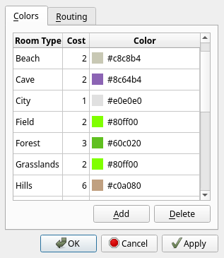
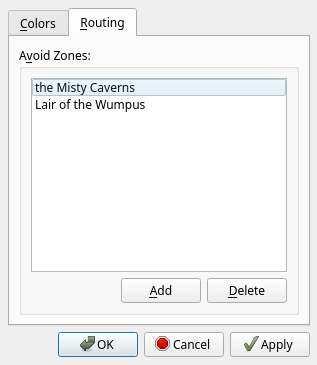

# Map Settings

The Map Settings dialog is accessible from the menu bar and allows you to configure map rendering, routing, and automapping.

On any tab, click "OK" to save your changes and close the dialog, "Cancel" to close the dialog without saving, or "Apply" to save your changes
without closing the dialog.

## Colors

On the Colors tab, you can configure the colors used by the [mini-map](session-docks.md#mini-map) and [Map Explorer](map-explorer.md).  You can also
specify the cost of traversing each room type, which is used when [pathfinding routes](commands/route.md).

On MUDs using GMCP, the automapper automatically adds terrain types to this list as they are detected. By default, newly detected terrain types are
given a cost of 1 and a color that is guessed based on the name.

Double-click on the name, cost, or color of a terrain type to edit it. Changing the color will open a color picker.

Click "Add" to add additional terrain types. Click "Delete" to delete the selected terrain types.

MUDs that do not use GMCP will guess colors for rooms based on the room name. These default colors are not customizable.

## Routing

The Routing tab allows you to specify zones that should not be considered when calculating routes. You can calculate a route into or out of an
avoided zone, but pathfinding will not pass through avoided zones. You can use this to avoid dangerous areas or regions that require special
abilities (like flying) to traverse.

Double-click on a line to select a zone to avoid.

Click "Add" to add a line to the Avoid Zones list. Click "Delete" to delete the selected line.

-----

[Back: Waypoints](map-waypoints.md) &bull; [Up: Table of Contents](index.md) &bull; [Next: Item Database](itemdb.md)
