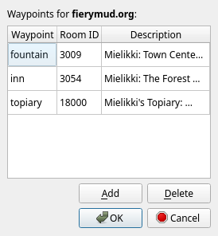

# Waypoints

Waypoints are like bookmarks that let you store a location on the map for later reference. Waypoints are shared between profiles on the same server.

The [`/WAYPOINT` command](commands/waypoint.md) is the main way to work with waypoints in Galosh. The [Map Explorer](map-explorer.md) also provides
a Waypoints dialog to view and manage waypoints graphically.

Once you have created a waypoint, its name can be used as a destination in routing and exploration:

* The [`/ROUTE` command](commands/route.md) calculates the fastest path to a named waypoint.
* The [`GOTO` command](commands/goto.md) in the Map Explorer sets the current room to a named waypoint.
* The [`.` prefix](commands/speedwalk.md) speedwalks to a named waypoint.

See the documentation for the `/WAYPOINT` command for more information about creating and managing waypoints.

## Waypoints dialog

The main table in the Waypoints dialog displays the list of recorded waypoints, including:

* The name of the waypoint.
* The numeric ID of the room.
* The zone and name of the room.

Double-click a waypoint's name or room ID to edit it.

Waypoint names cannot contain spaces. If the numeric room ID does not correspond to a known room, the description will read "[invalid]". A waypoint
with an invalid name or room ID cannot be saved.

Click the "Add" button to create a new waypoint. Click the "Delete" button to remove selected waypoints.

Click the "OK" button to save your changes and close the Waypoints dialog. Click the "Cancel" button to close the dialog without saving your changes.

-----

[Back: Mapping](map.md) &bull; [Up: Table of Contents](index.md) &bull; [Next: Map Settings](map-settings.md)
