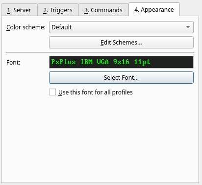
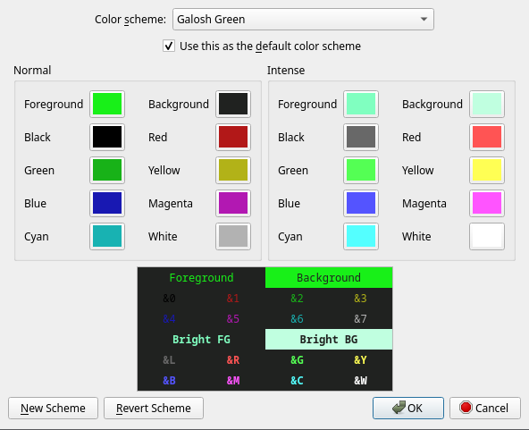

# Profiles - Appearance Tab

The Appearance tab in the Profiles dialog is used to change color schemes and fonts.

## Color scheme

Galosh includes a variety of color schemes by default. The default is Galosh Green.

The other color schemes include:

* <ins>CGA Green / CGA Amber / CGA White</ins>: Color palettes designed to imitate the colors of the IBM 5153 CGA monitor. These palettes have a
    lower brightness for the intense colors and use a distinct brown color instead of dark yellow.
* <ins>EGA Green / EGA Amber / EGA White</ins>: Color palettes designed to imitate the colors of the IBM 5154 EGA monitor and later VGA monitors.
    These palettes have darker dark colors and brighter intense colors compared to CGA.
* <ins>Linux Green / Linux Amber / Linux White</ins>: Color palettes based on the colors used in the Linux text console. Similar to the EGA color
    schemes, but a little brighter all around.
* <ins>Mono Green / Mono Amber / Mono White</ins>: Color palettes inspired by old monochrome terminals with green, amber, or white phosphors. Instead
    of providing 16 distinct colors, these palettes use shades of a single base color.
* <ins>CGA Blueprint / EGA Blueprint / Linux Blueprint</ins>: Color palettes mimicking the white-on-blue style popular in DOS applications. The
    background color intentionally differs from the traditional shade of blue for better readability.
* <ins>CGA Light Mode / EGA Light Mode / Linux Light Mode / Mono Light Mode</ins>: Dark-on-light color palettes. Intense colors in these palettes are
    darker than the normal colors instead of brighter to make them more distinct against the light background.

The color scheme selected here will only apply only to the current profile. This may be used to make different sessions visually distinct from each
other when you are using multiple characters at once.

The "Edit Schemes..." button will allow you to create additional custom color schemes and to select a default color scheme for all profiles.

## Edit Schemes...

This window allows you to customize the colors of the built-in color schemes or create new color schemes.

Click on any of the 16 color swatches to select a different color. The preview area shows what the chosen colors will look like in use.

If "Use this as the default color scheme" is checked, it will be used for any profile with the "Default" color scheme selected.

The "New Scheme" button will prompt you for a name and create a copy of the selected color scheme.

If one of the default color schemes is selected, the "Revert Scheme" button will undo any changes to it and restore the original colors. This button
is replaced with "Delete Scheme" for custom color schemes. Any profiles using a color scheme that is deleted will fall back to the default color
scheme.

## Font

Click the "Select Font" button to open a font chooser dialog. Galosh only supports monospaced fonts.

Check the "Use this font for all profiles" box to replace the font selection in all profiles with the current font.

-----

[Back: Profiles - Commands Tab](profiles-commands.md) &bull; [Next: Profiles - Appearance Tab](profiles-appearance.md)
