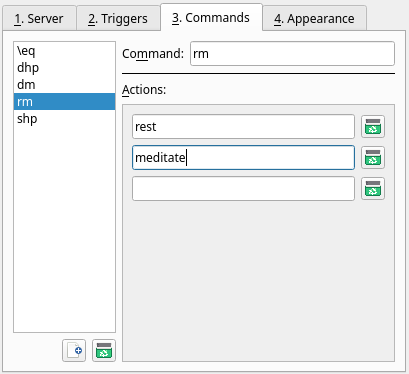

# Profiles - Commands Tab

The Commands tab in the Profiles dialog is used to create customized text commands, also known as "aliases."

## Command list

On the left side of the Commands tab is the list of existing commands. Click on a row in this list to edit the associated command. You can switch
between commands without losing unsaved changes.

Click the New Command button to create a new command. Click the Delete Command button to remove the currently selected command.

## Command

This field defines what you type in the [command line](session-commandline.md) to run your custom command.

Commands may not contain spaces but may contain other characters. Commands may not start with `/` or `.` to avoid conflicts with slash commands or
speedwalk paths.

## Actions

The actions are the sequence of commands that are executed when the custom command is used.

To add an action to the list, type in an empty row. A new blank row will be created to ensure that there is always at least one blank row at the
bottom of the list.

To remove an action from the list, click the Remove button beside it.

Actions may include [slash commands](sessions-commands.md), [speedwalk paths](commands/speedwalking.md), and other custom commands. If any of these
are used, then the next action will not be run until the previous one is completed. Any other action is sent to the MUD directly, with no delay.

A command may not trigger itself with an action, not even indirectly. If an action matches its own command, or matches any command that triggered it,
it will be sent to the MUD as-is instead. For example, if a command `wake` had the actions `wake` and `stand`, the MUD will receive `wake` and
`stand` instead. This may be used to add additional behaviors to a normal MUD command. (_Note: This is currently broken. A command that references
itself will cause Galosh to hang._)

## Parameters

Custom commands can make use of parameters, which are given as additional words in the command line separated by spaces. Use quotation marks (`"`)
to include spaces inside a parameter.

To use parameters, put placeholders in the actions. Like in triggers, placeholders are introduced with a `%` character. `%1` will be replaced by the
first parameter, `%2` will be replaced by the second parameter, and so on.

If fewer than the specified number of parameters are given, any additional placeholders will be removed. As an alternative, you may provide a default
value for a placeholder that will be used instead. A placeholder with a default value is written as `%{<number>:<default value>}`. For example,
`%{1:door}` will be replaced with the word "door" if no parameters are provided.

Add a `+` to a placeholder to additionally include all parameters following it. This allows multiple words to be inserted without quotation marks.
For example, `%2+` will capture the second parameter as well as any other parameters after it. `%*` is an alternative way to write `%1+`.

### Examples

* Command: `MyCommand`
* Action: `say %1`
    * Input: `MyCommand`
    * Output: `say `
        * _Placeholders for missing parameters are removed._
    * Input: `MyCommand Hello, world!`
    * Output: `say Hello,`
        * _Spaces separate placeholders._
    * Input: `MyCommand "Hello, world!"`
    * Output: `say Hello, world!`
        * _Quotation marks combine multiple words into a single parameter._
* Command: `od`
* Action: `unlock %{1:door}`
* Action: `open %{1:door}`
    * Input: `od`
    * Output: `unlock door`, then `open door`
        * _The default value is used if a parameter is not provided._
    * Input: `od gate`
    * Output: `unlock gate`, then `open gate`
        * _The parameter will replace each placeholder._
* Command: `tbold`
* Action: `tell %1 *** %2+ ***`
    * Input: `tbold tspil Listen to me!`
    * Output: `tell tspil *** Listen to me! ***`
        * _All parameters from the second onward are included in the output._

-----

[Back: Profiles - Triggers Tab](profiles-triggers.md) &bull; [Next: Profiles - Appearance Tab](profiles-appearance.md)
