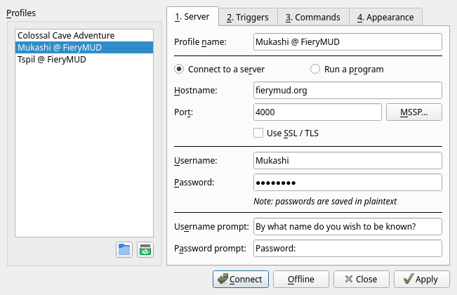
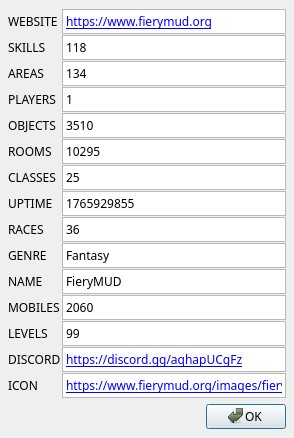

# Profiles - Server Tab

The Server tab in the Profiles dialog is used to configure how to connect to a server or program.

## Profile name

This is the name that will appear in the profile list and on the session's tab in the main Galosh window.

It is recommended that profile names should be unique, but this is not required.

## Connect to a server

Galosh can connect to a Telnet server or any line-based, plain-text TCP service.

When "Connect to a server" is selected, the following fields are available:

* <ins>Hostname</ins>: The hostname or IP address of the server.
* <ins>Port</ins>: The port number of the server. There is no standard port number for MUD servers, but 4000 is common.
* <ins>Use SSL / TLS</ins>: If checked, Galosh will connect to the server using an encrypted connection. See [SSL / TLS](session-tls.md) for more
    information about encrypted connections.
* <ins>MSSP</ins>: Click this button to check the server for [MSSP](#mssp) information.

## Run a program

Galosh can run text-based programs installed on your computer, such as classic text adventures including
[Colossal Cave Adventure](https://en.wikipedia.org/wiki/Colossal_Cave_Adventure) and [Zork](https://en.wikipedia.org/wiki/Zork).

**Note**: Not every text-based program is suitable for use in Galosh, as Galosh uses line-based input instead of sending individual keystrokes to the
program.  Command-line shells such as bash, PowerShell, and the Windows Command Prompt work well, but most text editors will not be usable.

When "Run a program" is selected, only one field is available:

* <ins>Program</ins>: The command line used to start the program.

## Automatic login

Galosh can try to automatically log in after connecting to a server or program.

Automatic login is controlled by these four fields:

* <ins>Username</ins>: The username (usually character name) used when logging in.
* <ins>Password</ins>: The password used when logging in.
* <ins>Username prompt</ins>: When this message is received, the username is sent.
* <ins>Password prompt</ins>: When this message is received, the password is sent. The password will appear as asterisks on screen.

The username and password will only be sent once per connection, no matter how many times the prompts are received. The default username and password
prompts are commonly found on DikuMUD derivatives.

**Note**: The password is stored in the [configuration file](config.md) unencrypted. Since most MUDs do not use encrypted connections, your password
would be sent insecurely over the Internet anyway, and any form of encryption that can be automatically decrypted provides very little security.
Never reuse passwords on multiple services, especially over insecure connections.

## MSSP

[MUD Server Status Protocol](https://mudstandards.org/mud/mssp) is a way for MUDs to provide information without requiring a user account. Clicking
on the MSSP button will connect to the MUD and check for MSSP data.

Note that the information in the MSSP window is provided by the MUD and may not be accurate.

-----

[Back: Profiles](profiles.md) &bull; [Up: Table of Contents](index.md) &bull; [Next: Profiles - Triggers Tab](profiles-triggers.md)
