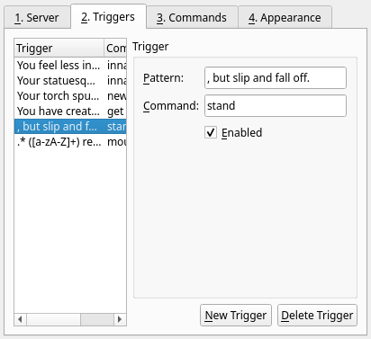

# Profiles - Triggers Tab

The Triggers tab in the Profiles dialog is used to set up automatic responses to received text.

## Trigger list

On the left side of the Triggers tab is the list of existing triggers. This list contains a short preview of the triggers that you have defined.
Click on a row in this list to edit the associated trigger. You can switch between triggers without losing unsaved changes.

Click the "New Trigger" button to create a new trigger. Click the "Delete Trigger" button to remove the currently selected trigger.

## Pattern

The pattern of a trigger is text that, when received, will activate the associated command.

Patterns are defined using [Perl-compatible regular expressions](https://www.regular-expressions.info/), often called "regexps" or "regexes" for
short. For most cases, you can usually just type in the exact text you wish to match. However, certain characters have special meanings that can be
used to match varying input text. Full documentation of all features supported by PCRE is beyond the scope of this document, but common special
characters include:

* `.`: Matches any character.
    * _For example, `a.c` will match `abc`, `adc`, and `a c`._
* `*`: Matches any number (including zero) of the previous character.
    * _For example, `ax*b` will match `ab`, `axb`, `axxb`, and so on._
* `+`: Matches one or more copies of the previous character.
    * _For example, `ax+b` will match `axb` and `axxb`, but not `ab`._
* `?`: Makes the previous character optional.
    * _For example, `ax?b` will match `ab` and `axb`, but not `axxb`._
* `\`: Matches the next character exactly instead of treating it as special. (This is also called "escaping" the character.)
    * _For example, `a\.c` will match `a.c`, but not `abc`._
* `(`...`)`: Parentheses create a capturing group that can be used in the associated command. See below for more information.
    * _For example, `(.+) says` will match `Mukashi says` and `Tspil says`, capturing `Mukashi` and `Tspil` respectively._

Patterns are case-sensitive. The matched text must all be contained within a single line, but it may occur anywhere within the line.

## Command

When the pattern is matched in a line of received text, Galosh will automatically send this command.

Multiple commands may be joined with the `|` character. For example, `wake|stand` will first send `wake`, and then send `stand`. Galosh will not wait
for a response between commands. If you want to include a `|` character in a command, use `\|`.

[Slash commands](sessions-commands.md) and [custom commands](profiles-commands.md) are supported in triggers.

### Capturing groups

Capturing groups specified in parentheses in the pattern can be used as substitutions in the command. Use `%` and a number to create a placeholder.
The first capturing group will replace `%1` in the command, the second will replace `%2`, and so on.

For example:

* Pattern: `(.+) tells you, 'hello'`
* Command: `tell %1 hi`

This trigger will send `tell Mukashi hi` if you receive `Mukashi tells you, 'hello'`.

## Enabled

When the Enabled box is checked, the trigger will work as described above. When it is unchecked, the pattern will not be checked against incoming
text. This can be used to save a trigger that you may not want to have active at all times.

New triggers are enabled by default.

-----

[Back: Profiles - Server Tab](profiles-server.md) &bull; [Up: Table of Contents](index.md) &bull; [Next: Profiles - Commands Tab](profiles-commands.md)
