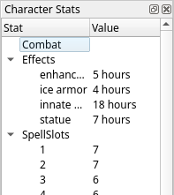
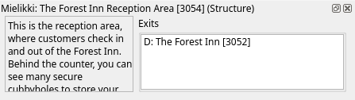
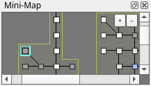

# Dockable Panels

The main window contains three dockable panels: the Character Stats panel, the Room Description panel, and the Mini-Map panel.

A dockable panel can be dragged to any side of the main window, either on its own or alongside other panels. It can be placed on top of another
panel to create a tabbed group. It can be detached to float as an independent window layered over the main window.

If you don't need the information that a panel provides, you can close it. Each panel has a corresponding menu item in the
[View menu](session-menus.md#view) that can be used to open it again.

Dockable panels will remember their placement for the next time you start Galosh.

## Character Stats Panel

The Character Stats panel displays statistics sent by the MUD using the [GMCP protocol](https://mudstandards.org/mud/gmcp).

While the GMCP protocol defines a common set of character information that MUDs are encouraged to provide, each MUD is free to supply any data that
it wants. As a result, this panel will look different from MUD to MUD, and may be blank if the MUD does not support GMCP or the GMCP `char` package.

By default, the Character Stats panel is docked to the right side of the main window.

## Room Description Panel

The Room Description panel displays information about the current room.

The title bar contains the current zone, the name of the current room, the numeric room ID, and the terrain type. Not all MUDs provide this data, so
any missing information will be omitted.

The room description is displayed with minimal formatting to make as much text visible as possible.

The Exits box shows which rooms are known to be accessible from the current room. Double-click on one of the rooms displayed in it to open the
[Map Explorer window](map-explorer.md).

Room information can be collected from descriptions displayed on screen, from `room` package data sent using the GMCP protocol, and from map data
imported from Mudlet. See the [Mapping page](map.md) for more information.

By default, the Room Description panel is docked to the top side of the main window, to the left of the Mini-Map panel.

## Mini-Map Panel

The Mini-Map panel displays your current location on the map.

Rooms in the MUD are shown as squares, and exits are shown as lines connecting rooms. The current room is highlighted with an outline. The appearance
of the mini-map can be customized in the [Map Settings dialog](map.md#map-settings).

Hover the mouse cursor over a room to show its name and numeric ID. Click the `+` and `-` buttons to zoom in and out, respectively.

Mapping information is automatically collected from the MUD using the same information as the Room Description panel above.

By default, the Mini-Map panel is docked to the top side of the main window, to the right of the Room Description panel.

-----

[Back: Main Window](session.md) &bull; [Up: Table of Contents](index.md) &bull; [Next: SSL / TLS](session-tls.md)
