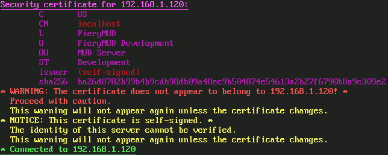

# SSL / TLS

Galosh supports SSL and TLS encryption when connecting to Telnet servers or plain-text services. Check "Use SSL / TLS" in the
[Server tab](profiles-server.md) of the Profiles dialog to enable encryption.

Encrypted connections usually use a different port number than unencrypted ones.  Check the MUD's website to see if it supports encryption and what
ports to use.

## Certificate management

As a safety measure, Galosh inspects the server's security certificate when making an encrypted connection. This is a similar process to the security
checks that a web browser performs when visiting a website.

Information about the security certificate will be displayed in the terminal during the connection process.

### Certificates and signatures

Most security certificates are signed by a signing authority. Galosh will abort the connection if the certificate or its signature is invalid,
expired, or revoked.

Self-signed certificates require special care. A self-signed certificate cannot be completely verified. The first time you connect to a server with
a self-signed certificate, Galosh will display a warning. You should inspect the certificate and check that it is correct.

### Certificate name

If the certificate includes a Common Name or Subject Alternative Names, the server's hostname is checked against it.

Galosh will display a warning if the hostname does not match. You should inspect the certificate and check that it is correct. This warning is only
displayed the first time you connect to the server.

### Certificate pinning

When you connect to an encrypted server for the first time, Galosh makes a record of the server's security certificate. On subsequent connections, if
the server's certificate does not match the one on record, Galosh will display a warning.

Security certificates expire and must be renewed periodically, so an updated certificate may not be a sign of a problem. However, a certificate
that has changed unexpectedly could be an indication that an attacker is impersonating the real MUD server. You should inspect the certificate and
check that it is correct.

-----

[Back: Dockable Panels](session-docks.md) &bull; [Up: Table of Contents](index.md) &bull; [Next: Offline Mode](session-offline.md)
