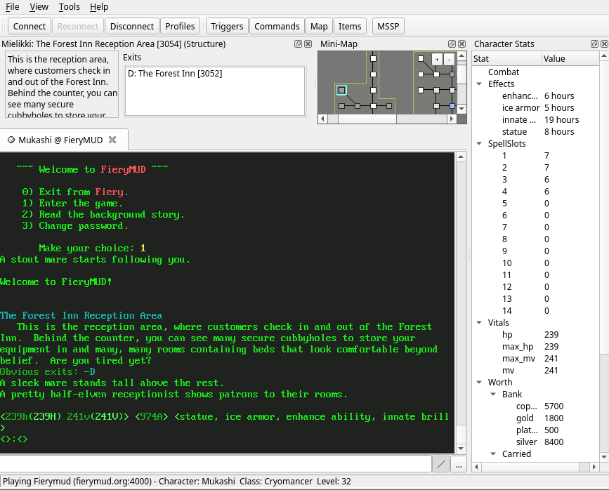

# The Galosh Main Window

The Galosh main window provides a [menu bar](session-menus.md), a [tool bar](session-menus.md#toolbar), and [dockable panels](session-docks.md) for a
mini-map, character stats, and a room description.

These surround the central focus of the Galosh main window: the line-based terminal emulator. Galosh's terminal emulator supports VT100 / ANSI
terminal control codes with 256-color and true-color extensions. The basic 16 colors of the terminal palette can be configured in the
[Appearance tab](profiles-appearance.md) of the Profiles dialog.

## Sessions

Each open session is presented as a tab along the top of the terminal emulator. Each tab has three parts:

* The label matches the name of the profile configured in the Profiles dialog.
* The icon indicates the state of the connection:
    *  <ins>Red</ins>: Disconnected.
    *  <ins>Gray</ins>: Connected, idle.
    *  <ins>Green</ins>: Connected, with unread text.
* The close button will remove the tab. Closing a tab will disconnect the session inside it.

Clicking on a tab will switch to the associated session.

The dockable panels and the status bar always reflect the information for the currently selected session.

## Command line

The command line is the main way you will interact with a session. Anything you type here will be sent to the MUD when you press Return or Enter,
unless it is a [Galosh command](session-commands.md), [custom command](profiles-commands.md), or [speedwalk path](commands/speedwalking.md).

Multiple commands may be joined with the `|` character. For example, `wake|stand` will first send `wake`, and then send `stand`. Galosh will not wait
for a response between commands. If you want to include a `|` character in a command, use `\|`.

### Parsing

The `/` button to the right of the command line toggles parsing mode.

When parsing mode is turned on (the default), Galosh processes the input for commands and line separators as described above.

When parsing mode is turned off, all commands typed into the command line are sent to the MUD unmodified.

### Multiline editing

The `…` button to the right of the command line opens the multiline editor. Any text in the command line will appear in the multiline editor, with
`|` characters becoming separate lines as described above.

Most common text editing commands work in the multiline editor. Press ↵ in the multiline editor to add a line.

Text typed into the multiline editor is not sent until you press Ctrl+↵ (or ⌘+↵ on macOS). The multiline editor will close and all lines in it will
be sent together, with no delay between them. If parsing mode is enabled, each line is separately processed for commands and speedwalk paths.

Press Escape to close the multiline editor without sending. The contents of the multiline editor will be preserved in the command line.

## Keyboard shortcuts

In addition to standard text editing shortcuts, these keyboard shortcuts are supported in the main window:

| Windows        | macOS       | Other          | Action |
| -------------- | ----------- | -------------- | ------ |
| Ctrl+O         | ⌘+O         | Ctrl+O         | Open the Profiles dialog to connect to a session |
| Ctrl+Tab       | ⌘+Tab       | Ctrl+Tab       | Switch to the next tab to the right |
| Ctrl+Shift+Tab | ⌘+Shift+Tab | Ctrl+Shift+Tab | Switch to the next tab to the left |
| Ctrl+F4        | ⌘+W         | Ctrl+W         | Close the current tab |
| Ctrl+P         | ⌘+P         | Ctrl+P         | Toggle command parsing |
| Ctrl+↵         | ⌘+↵         | Ctrl+↵         | Open the multiline editor, or send a multiline command |
| Esc            | Escape      | Esc            | Close the multiline editor |

-----

[Back: Profiles - Appearance Tab](profiles-appearance.md) &bull; [Up: Table of Contents](index.md) &bull; [Next: Main Window - Menus](session-menus.md)
